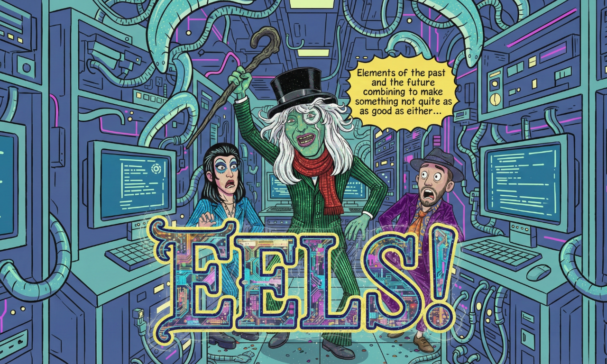

# EELS - Ergatis Extended Lifetime Support

Systematic extraction and preservation of institutional knowledge from the Ergatis bioinformatics workflow system (TIGR/JCVI/IGS, 2003-present).



## Objective

Extract and preserve 20+ years of production genomics annotation knowledge encoded in Ergatis components, converters, and workflows. Document in structured formats for translation to modern workflow languages (CWL/Nextflow/WDL).

## What is Ergatis?

Ergatis is a complete bioinformatics workflow platform including:
- **Component library** - 371 atomic workflow units
- **Converter library** - 91+ scripts transforming tool output to BSML XML
- **Workflow templates** - 56 production pipelines
- **Web interface** - Pipeline builder and monitoring
- **BSML format** - XML data exchange for Chado database loading

This is production-tested, FDA-approved software representing institutional knowledge from TIGR/JCVI/IGS genomics annotation pipelines.

## Progress

### Completed (Phases 1-3)

**Data Extraction:**
- 362 components analyzed → `data/components/*.json`
- 254 iterator patterns cataloged → `data/iterator_catalog.json`
- 56 workflows cataloged → `data/workflow_catalog.json`
- 91 converters identified → `data/converter_catalog.json`
- 65 converter manpages extracted → `data/manpages/*.txt`
- 28 contributors identified → `data/contributors.json`

**Documentation:**
- Component anatomy walkthrough → `docs/COMPONENT_ANATOMY.md`
- Converter reference guide → `docs/CONVERTER_REFERENCE.md`
- BSML converter catalog → `docs/BSML_CONVERTER_CATALOG.md`
- Ergatis Lite specification → `docs/ERGATIS_LITE_SPEC.md`
- Contributor attribution → `CONTRIBUTORS.md`

### Remaining Work

**Phase 4: BSML Schema** - Document XML structure and semantics
**Phase 5: Translation Strategy** - Map primitives to modern formats
**Phase 6: Proof-of-Concept** - Working translations (CWL/Nextflow/WDL)
**Phase 7: Final Documentation** - Complete knowledge preservation

See `NEXT_STEPS.md` for detailed plan.

## Repository Structure

```
eels/
├── data/                    # Structured metadata (JSON)
│   ├── components/          # 362 component definitions
│   ├── manpages/            # 65 converter manpages
│   ├── component_summary.json
│   ├── iterator_catalog.json
│   ├── workflow_catalog.json
│   └── converter_catalog.json
├── docs/                    # Generated documentation
│   ├── converters/          # Deep converter analysis
│   ├── COMPONENT_ANATOMY.md
│   ├── CONVERTER_REFERENCE.md
│   └── BSML_CONVERTER_CATALOG.md
├── scripts/                 # Extraction tools
│   ├── analyze_components.py
│   ├── catalog_iterators.py
│   └── catalog_workflows.py
├── CONTRIBUTORS.md          # Attribution
├── NEXT_STEPS.md           # Remaining work
├── STATUS.md               # Progress tracking
└── WORKPLAN.md             # Original plan

```

## Source Material

- **Ergatis source:** `~/repos/eels/ergatis-eels-devel/ergatis-git/`
- **Components:** 371 directories in `components/`
- **Converters:** 91+ scripts in `src/perl/`
- **Workflows:** 56 templates in `workflow/`
- **Documentation:** `doc/workflowxml.txt`, POD in scripts

## Project Context

**Lead:** Brett Whitty (GNOMATIX), original TIGR developer  
**Started:** 2026-02-18  
**Status:** Phase 3 complete (data extraction), Phase 4-7 remaining

This is a multi-month knowledge preservation effort. Current focus is systematic extraction and documentation, not running code.
